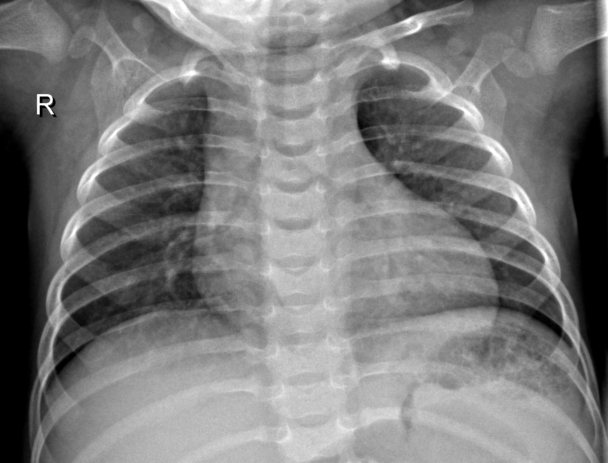
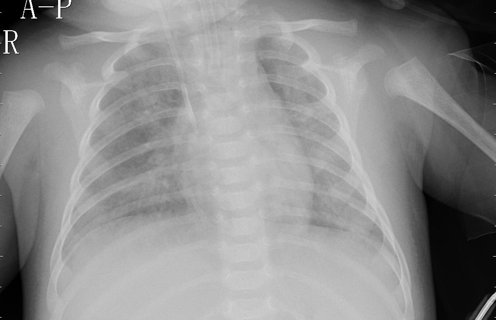

# PneumoNet

#### Name: Jack Risse
#### School: Flatiron
#### Project: Capstone
#### Date: 1/3/2020

#### <strong>DISCLAIMER! In no way, shape or form am I a medical professional.</strong>

## Desire
> When starting my journey in Data Science, being able create insights and maybe even products to help them thrive seemed to be a novel concept, but that is not who I am. I have always strived to help and make impact. I was taught as a child to be the good sumaritan and leave a place better than when it was found. So when I saw this dataset on Kaggle what data scientist were doing with it gave me a passion to use my skills to make difference in a way that a person can benefit from it not be decieved and used from their own data.

## About
> The objective of this project was to use Convolution Neural Networks to diagnose chest x-rays. Transfer learning was used
to train the model. The base model was MobileNet that was pre-trained on the imagenet dataset. I used a software engineering approach because of obstacles that I faced with the servers and memory issues when dealing with notebooks. But there is an advantage to that it comes to time to implement the model to an application or product.

> Why I chose MobileNet pre-trained model?
> Since the access to GPUs is not affordable for a student I couldn't train with a model that requires a substantial amount of computing power. So I had to MobileNet because the model was optimized to be used with mobile applications.

### MobileNet
> MobileNet uses depth-wise separable convolutions. Such convolutions reduces the number of times multiplication computation is performed. The CNN was made for mobile and embedded computer vision applications. Cornell wrote a paper on the <a href="https://arxiv.org/abs/1704.04861">MobileNet</a>.

> #### ImageNet

> imagenet is a dataset that all of the pre-trained models use to train their models. The dataset contains over 14 million images with 1000 different classes. To learn more about the imagenet dataset to go to <a href="http://image-net.org/about-overview">here</a>.

### Data
> The data came from <a href="https://www.kaggle.com/paultimothymooney/chest-xray-pneumonia">Kaggle</a>. The dataset had some class imbalance with a ratio of about 27% of x-ray with no pneumonia and 73% of x-rays with pneumonia. So after data augmentation, 42% of x-rays with no pneumonia and 58% of x-ray with pneumonia. There still is some class imbalance but not that much to make a impact on accuracy and definitely better than 27% and 73%.

> #### Input Image Size (width, height, channels)
> #### Size: (260, 180, 3)
> In the competition on Kaggle, most of the participants resized their images to (150, 150, 3) which seems to be a convention, but for some reason just inserting the metrics because of convention and no explanation of why that's the convention really bothers. So I found the mean size of the imgs and rounded the average sizes and made an aspect ratio (13:9) so 13 * 20 = 260 and 9 * 20 = 180 and that's how I got the my image size. Another reason why I didn't want to use (150, 150, 3) because if you are able to keep the images larger without compromising the restraints when not running on a GPU or have ample space of memory, the model can extract more specific features in the pictures due to them being bigger in size.

> #### Train set
> Number of Imgs: 4760 imgs

> #### Validation set
> Number of Imgs: 1191 imgs

> #### Test set
> Number of Imgs: 1488 imgs

### Normal

### Pneumonia

### Data augmentation
> The images went through a random transformation. The augmented data was put through a rotation of 0-90 degrees of rotation, move up or down, or flip vertically or horizontally.

### Pipeline to the Results
> Data was imported, no pneumonia images were augmented and saved, all images were read and converted to a matrix and into an array, then split into train, val, and test sets, trained the model, and finally then tested

## Problems
> I originally wanted to do create my own CNN but through doing that I found out that computation power and memory storage really
inhibits the capabilities of creating an acceptable model that performs correctly. I tried using Google Colab and the GPU service they provide but the importing the images and saving everything just wasn't efficient. Also, when I finally got the images imported and converted the notebook would crash due to the amount of RAM is offered in Google Colab. So transfer learning allowed me to classify the x-rays without creating a deep and exhausting model.

## Results
> Training
>> Accuracy: above 95%
> Validating
>> Accuracy: above 95%
> Testing
>> Accuracy: 96.2%
>> Recall: 94.5%
>> Precision: 98.9%

> ** recall couldn't be calculated for training and validating due to the keras trains models **
#### My results beat the winner of the Kaggle competition the dataset was derived from.
